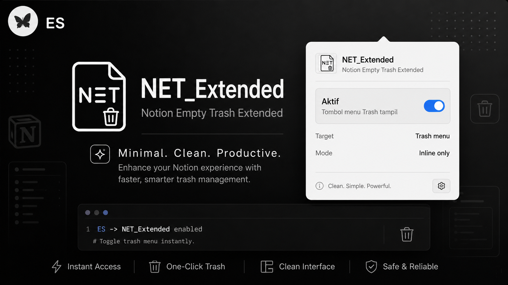

# NET_Extended



Notion Empty Trash Extended is a browser extension that adds an inline `Empty Trash` button to Notion's Trash menu.

This build keeps the button focused on one inline target only:

```text
notion-empty-trash-inline-button-v2
```

It also includes a small extension popup with an on/off toggle, so the button can be shown or hidden without removing the extension.

## Features

- Adds `Empty Trash` directly inside Notion's Trash menu.
- Keeps only one injected button: `notion-empty-trash-inline-button-v2`.
- Supports Chrome / Chromium and Firefox builds.
- Includes a clean `NET_Extended` popup UI.
- Lets you turn the inline button on or off from the extension menu.
- Uses the updated NET_Extended logo and banner assets.

## Chrome / Chromium

1. Open `chrome://extensions`.
2. Enable Developer mode.
3. Click Load unpacked.
4. Select the `chrome` folder.
5. Open or refresh Notion.
6. Open Trash from the Notion sidebar.
7. The `Empty Trash` button should appear inside the Trash menu.
8. Click the `NET_Extended` extension icon to toggle the feature on or off.

## Firefox

1. Open `about:debugging#/runtime/this-firefox`.
2. Click Load Temporary Add-on.
3. Select `manifest.json` inside the `firefox` folder.
4. Open or refresh Notion.
5. Open Trash from the Notion sidebar.
6. The `Empty Trash` button should appear inside the Trash menu.
7. Click the `NET_Extended` extension icon to toggle the feature on or off.

## Notes

This extension permanently deletes items from Notion Trash after confirmation. Use it carefully.

If the button does not update after changing files, reload the extension from your browser's extension/debugging page and refresh the Notion tab.

## Original Credit

Shout out to the original project and idea:

- [tobyxdd/notion-empty-trash](https://github.com/tobyxdd/notion-empty-trash)

NET_Extended builds on the same core idea: adding an `Empty Trash` button to Notion's Trash menu, with additional packaging, popup UI, branding, browser folders, and an on/off toggle.
